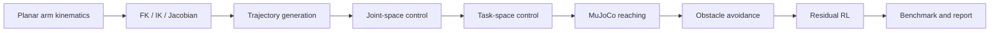

# MuJoCo Arm Manipulation Lab

## Overview

This repository is an early-stage robot arm manipulation mini-lab for studying classical kinematics, trajectory generation, Jacobian-based control, MuJoCo reaching, obstacle avoidance, and residual RL.

## Motivation

This project extends the residual-learning idea from locomotion to manipulation. Instead of learning every behavior from scratch, it investigates whether classical robot control components can provide useful priors for learning-based arm reaching and obstacle avoidance.

## Planned Pipeline



## Project Stages

| Stage | Folder | Goal | Status |
| --- | --- | --- | --- |
| 01 | `01_kinematics/` | FK, IK, Jacobian, workspace visualization | Scaffold / early implementation |
| 02 | `02_trajectory/` | cubic, quintic, minimum-jerk trajectories | Scaffold / early implementation |
| 03 | `03_control/` | joint-space PD, task-space control, Jacobian transpose control | Scaffold / early implementation |
| 04 | `04_mujoco_reaching/` | MuJoCo arm XML, reaching task, video recording | Scaffold |
| 05 | `05_obstacle_avoidance/` | potential field and obstacle-reaching benchmark | Scaffold |
| 06 | `06_residual_rl/` | vanilla PPO vs controller-prior residual PPO | Planned / scaffold |

## Research Questions

1. Can FK / IK / Jacobian methods provide reliable reaching priors for a simple planar arm?
2. How do trajectory profiles affect smoothness and control effort?
3. Can task-space controllers outperform simple joint-space controllers for reaching?
4. Can obstacle avoidance be handled with classical potential-field methods?
5. Can residual RL improve over a classical controller baseline?
6. How does residual PPO compare against vanilla PPO in sample efficiency and final accuracy?

## Repository Structure

```text
mujoco-arm-manipulation-lab/
├── configs/                  # YAML configuration files for arms, control, trajectory, and reaching
├── common/                   # Shared kinematics, trajectory, control, metrics, and plotting utilities
├── 01_kinematics/            # FK, IK, Jacobian, workspace, and singularity demos
├── 02_trajectory/            # Trajectory generation and profile comparison demos
├── 03_control/               # Classical joint-space and task-space control demos
├── 04_mujoco_reaching/       # MuJoCo planar arm XML, reaching demo, and video recording scripts
├── 05_obstacle_avoidance/    # Potential-field obstacle avoidance and benchmarks
├── 06_residual_rl/           # Vanilla PPO and residual PPO experiment skeletons
├── reports/                  # Project plan, stage notes, and results index
└── results/                  # Generated plots, tables, and videos
```

## Current Status

This repository currently defines the staged workflow for a robot arm manipulation mini-lab and includes initial scaffolding for kinematics, trajectory generation, control, MuJoCo reaching, obstacle avoidance, and residual RL. Some early utility scripts may be present, but benchmark-quality results will be added stage by stage.

This project is intentionally staged. The goal is to build the manipulation stack incrementally rather than claiming a finished RL benchmark from the beginning.

## Quick Start

### Setup

```bash
pip install -r requirements.txt
```

### Current Smoke Checks

```bash
python -m unittest discover -s tests
python 01_kinematics/fk_ik_demo.py
python 01_kinematics/jacobian_demo.py
python 01_kinematics/workspace_visualization.py
python 02_trajectory/trajectory_generation_demo.py
python 02_trajectory/compare_trajectory_profiles.py
```

### Planned Later

These commands are planned for later stages and should not be interpreted as finished benchmark results yet:

```bash
python 03_control/joint_space_pd_demo.py
python 03_control/task_space_control_demo.py
python 03_control/jacobian_transpose_demo.py
python 04_mujoco_reaching/inspect_model.py
python 04_mujoco_reaching/reaching_pd_demo.py
python 04_mujoco_reaching/record_video.py
python 05_obstacle_avoidance/potential_field_demo.py
python 05_obstacle_avoidance/benchmark_obstacle_reaching.py
python 06_residual_rl/train_vanilla_ppo.py
python 06_residual_rl/train_residual_ppo.py
python 06_residual_rl/evaluate_policies.py
```

## Expected Outputs

* kinematics plots
* workspace visualization
* trajectory comparison plots
* MuJoCo reaching videos
* obstacle avoidance benchmark tables
* residual RL comparison tables
* final technical report

## Reports

* [Project Plan](reports/project_plan.md)
* [Results Index](reports/results_index.md)
* [Roadmap](ROADMAP.md)
* [TODO](TODO.md)
* [Final Report](reports/final_report.md)

## Future Work

1. Complete and validate the kinematics and trajectory smoke demos.
2. Implement and benchmark joint-space and task-space controllers.
3. Build a MuJoCo reaching environment with reliable video recording.
4. Add obstacle avoidance with collision and path-quality metrics.
5. Compare vanilla PPO with controller-prior residual PPO.
6. Add benchmark tables, plots, demo videos, and a final technical report.
