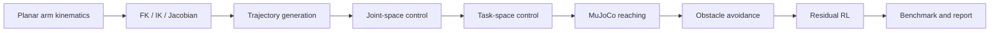

# MuJoCo Arm Manipulation Lab

## Overview

This repository is an early-stage robot arm manipulation mini-lab for studying classical kinematics, trajectory generation, Jacobian-based control, MuJoCo reaching, obstacle avoidance, and residual RL.

## Motivation

The project extends the residual-learning idea from locomotion to manipulation. Instead of learning every behavior from scratch, it investigates whether classical robot control components can provide useful priors for learning-based arm reaching and obstacle avoidance.

## Planned Pipeline



## Project Stages

| Stage | Folder | Goal | Status |
| --- | --- | --- | --- |
| 01 | `01_kinematics/` | FK, IK, Jacobian, workspace visualization | Initial implementation |
| 02 | `02_trajectory/` | cubic, quintic, minimum-jerk trajectories | Initial implementation |
| 03 | `03_control/` | joint-space PD, task-space control, Jacobian transpose control | Initial implementation |
| 04 | `04_mujoco_reaching/` | MuJoCo arm XML, reaching task, video recording | Initial implementation |
| 05 | `05_obstacle_avoidance/` | potential field and obstacle-reaching benchmark | Initial implementation |
| 06 | `06_residual_rl/` | vanilla PPO vs controller-prior residual PPO | Interface benchmark |

## Research Questions

1. Can FK / IK / Jacobian methods provide reliable reaching priors for a simple planar arm?
2. How do trajectory profiles affect smoothness and control effort?
3. Can task-space controllers outperform simple joint-space controllers for reaching?
4. Can obstacle avoidance be handled with classical potential-field methods?
5. Can residual RL improve over a classical controller baseline?
6. How does residual PPO compare against vanilla PPO in sample efficiency and final accuracy?

## Repository Structure

```text
mujoco-arm-manipulation-lab/
├── configs/                  # YAML configuration skeletons for arms, control, trajectory, and reaching
├── common/                   # Shared kinematics, trajectory, control, metrics, and plotting utilities
├── 01_kinematics/            # FK, IK, Jacobian, workspace, and singularity demos
├── 02_trajectory/            # Trajectory generation and profile comparison demos
├── 03_control/               # Classical joint-space and task-space control demos
├── 04_mujoco_reaching/       # MuJoCo planar arm XML, reaching demo, and video recording scripts
├── 05_obstacle_avoidance/    # Potential-field obstacle avoidance and benchmarks
├── 06_residual_rl/           # Vanilla PPO and residual PPO experiment skeletons
├── reports/                  # Project plan, stage notes, and results index
└── results/                  # Generated plots, tables, and videos
```

## Current Status

This repository now contains first-pass implementations from kinematics through residual PPO smoke training. Results are early-stage and should be treated as development benchmarks rather than final experimental claims.

The current technical report is available at `reports/final_report.md`.

## Quick Start

```bash
pip install -r requirements.txt
```

MuJoCo and stable-baselines3 are needed only for later stages. Stage-specific commands will be added as each component is implemented.

Run the current Stage 01 checks:

```bash
python -m unittest discover -s tests
python 01_kinematics/fk_ik_demo.py
python 01_kinematics/jacobian_demo.py
python 01_kinematics/workspace_visualization.py
python 02_trajectory/trajectory_generation_demo.py
python 02_trajectory/compare_trajectory_profiles.py
python 03_control/joint_space_pd_demo.py
python 03_control/task_space_control_demo.py
python 03_control/jacobian_transpose_demo.py
python 04_mujoco_reaching/inspect_model.py
python 04_mujoco_reaching/reaching_pd_demo.py
python 04_mujoco_reaching/record_video.py
python 05_obstacle_avoidance/potential_field_demo.py
python 05_obstacle_avoidance/benchmark_obstacle_reaching.py
python 05_obstacle_avoidance/record_obstacle_video.py
python 06_residual_rl/evaluate_policies.py
python 06_residual_rl/train_vanilla_ppo.py
python 06_residual_rl/train_residual_ppo.py
python 06_residual_rl/compare_ppo_results.py
python 06_residual_rl/run_sample_efficiency.py
python 06_residual_rl/record_policy_video.py
```

## Expected Outputs

* kinematics plots
* workspace visualization
* trajectory comparison plots
* MuJoCo reaching videos
* obstacle avoidance benchmark tables
* residual RL comparison tables
* final technical report

## Future Work

1. implement 2-link and 3-link FK / IK / Jacobian
2. implement trajectory generation and visualization
3. implement joint-space and task-space controllers
4. build MuJoCo reaching environment
5. add obstacle avoidance benchmark
6. train vanilla PPO and residual PPO
7. write final portfolio report
